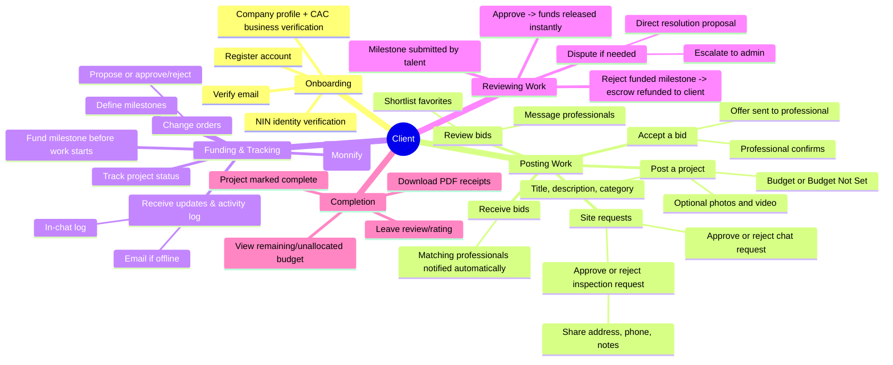
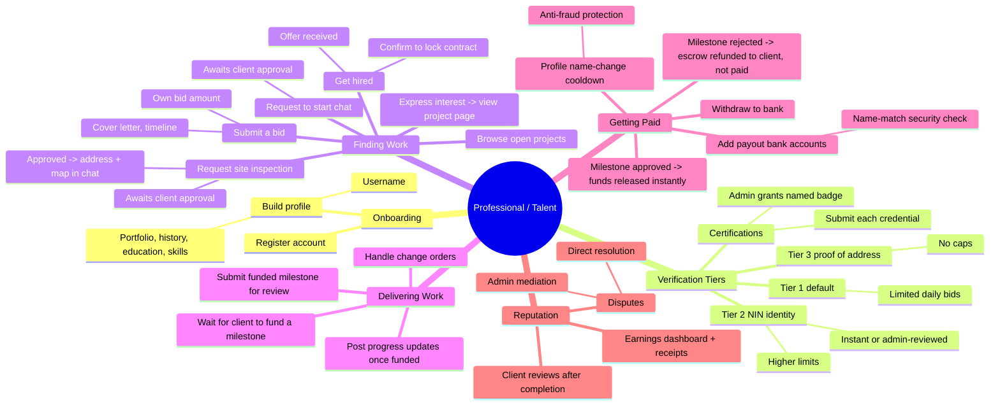
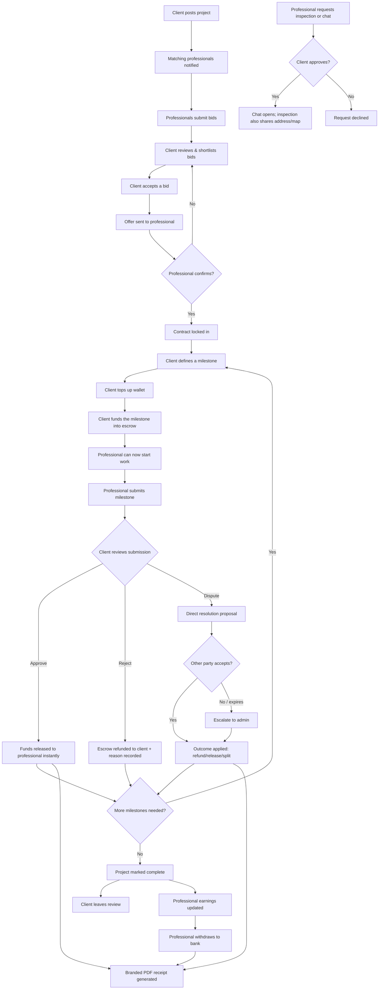
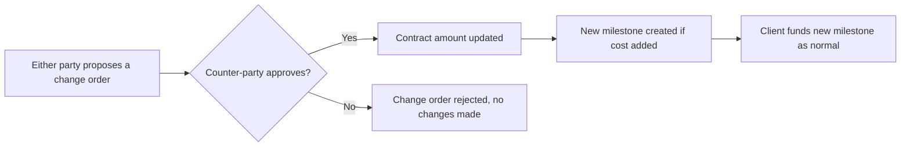
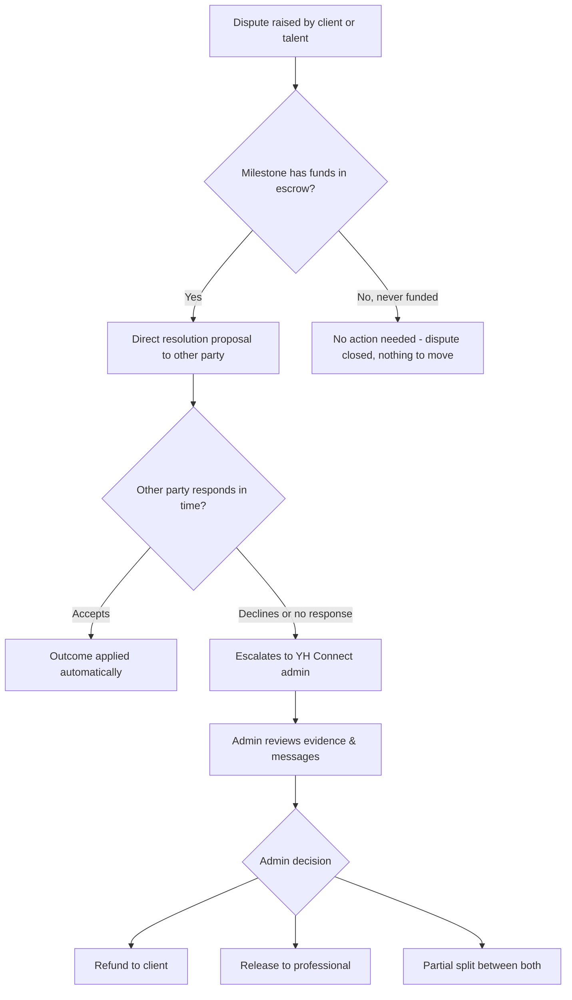
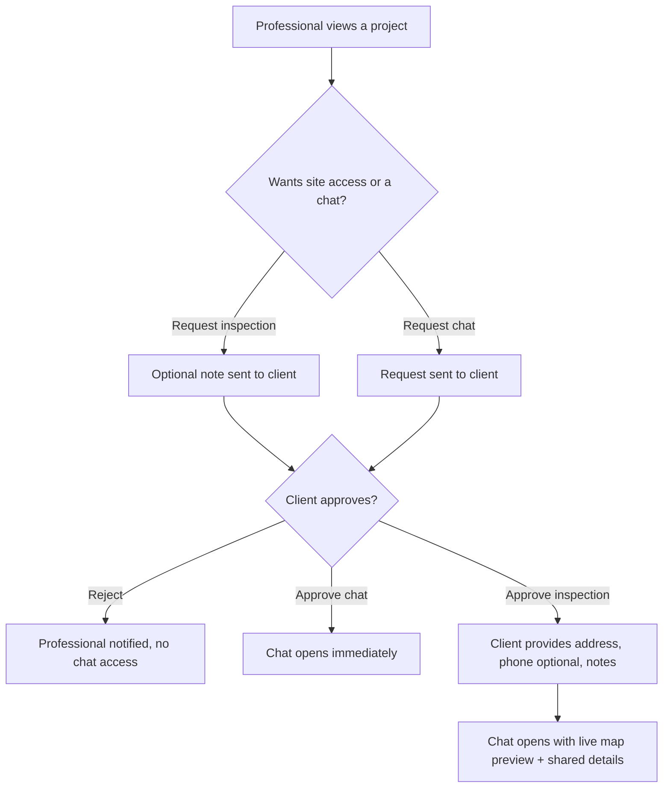

# YH Connect — Platform Workflow Overview

YH Connect is a marketplace that connects **clients** (people/companies who need construction work done — architecture, engineering, contracting, and trades) with **professionals/talent** (verified individuals who do that work), with **YH Connect admin** operating the platform, mediating disputes, and holding payments safely in escrow until work is approved.

This document walks through what each side of the platform does, step by step, from account creation through to a project being paid and closed out.

---

## 1. The Three Roles

| Role | Who they are | What they do |
|---|---|---|
| **Client** | Anyone hiring for a construction project | Posts projects, reviews bids, hires talent, funds milestones before work starts, approves work, pays |
| **Professional / Talent** | Architects, engineers, contractors, trades | Builds a profile, gets verified, browses/bids on projects, delivers work only once funded, gets paid |
| **Admin** | YH Connect platform operator | Verifies identities/businesses/credentials, moderates content, resolves disputes, configures the platform, oversees all payments |

A single person can hold **both** a client account and a talent profile on the same login (e.g. a contractor who also hires subcontractors) — the dashboard has a role switcher.

---

## 2. Client Journey — Step by Step

1. **Register** — signs up with email/password, company name, and industry. Verifies their email.
2. **Identity verification (KYC)** — before a client can invite, message, or accept a bid from a professional, they must verify their identity via NIN (National Identification Number). This protects professionals from fake clients and keeps direct contact accountable.
3. **Complete company profile** — company name, logo, description, website, and (optionally) submits **CAC registration documents** for admin review to earn a **Verified Business** badge, which builds trust with talent.
4. **Post a project** — describes the work, sets a budget (or leaves it as **"Budget Not Set"** if they don't know the cost yet, so talent send their own quote), category, and location. Optionally attaches **photos** (on by default) and a **video** — upload or link — if the admin has enabled video for the platform. Posting is free.
5. **Receive bids** — verified professionals matching the category are notified automatically and can submit bids (their proposed amount, cover letter, estimated timeline).
6. **Review & shortlist** — the client reviews all bids, can shortlist favorites for later comparison, and message professionals directly to ask questions before deciding.
7. **Site inspection & chat requests** — before bidding or hiring, an interested professional can ask to **inspect the site in person** or simply **start a chat**. The client sees each request and can approve or reject it. Approving a chat request opens messaging immediately; approving an inspection request also asks the client for the **site address, an optional phone number, and any other details**, which then appear (with a live map preview) inside the chat with that professional.
8. **Accept a bid → Offer & Confirmation** — accepting a bid sends a formal offer to the professional, who must explicitly confirm before the contract is locked in (protects both sides from a one-sided "acceptance").
9. **Define and fund milestones — before work starts** — only the client creates milestones (title, description, amount). Each milestone must be **funded from the client's wallet into escrow before the professional can begin any work on it** — no work happens on faith. The client tops up their wallet via Monnify, then funds the milestone.
10. **Track progress** — the client watches project status, milestone progress, and receives **project updates** and a running **activity log** (all milestone/change-order/payment events) inside the same chat thread used to message the professional. If the client is offline, updates are also emailed.
11. **Review submitted work — approve or reject with a reason** — when the professional posts an update and submits a funded milestone as done, the client reviews it and either:
    - **Approves** — payment releases to the professional **instantly**, in the same action (there's no separate "release payment" step anymore), or
    - **Rejects, with a required reason** the professional can see — if the milestone was already funded, the escrowed amount is **refunded straight back to the client's wallet** rather than paid out, ready to fund another attempt or a different milestone.
12. **Change orders** — if scope changes mid-project (e.g. budget needs to increase from ₦75k to ₦80k), either party can propose a change order; the *other* party must approve it before it takes effect, updates the contract amount, and (for cost increases) creates a new milestone ready to be funded.
13. **Handle disputes (if needed)** — if something goes wrong, the client can raise a dispute (tied to a specific milestone or the whole project). Parties can first try to resolve it directly (propose a settlement the other side accepts/declines); unresolved disputes escalate to a YH Connect admin who reviews evidence and decides the outcome (refund, release, partial split, or no action if no funds were ever at stake).
14. **Project completion** — once all milestones are settled, the project is marked complete. The client can leave a **review/rating** for the professional.
15. **Payment history & receipts** — every transaction (funding, release, refund) is recorded with a branded, downloadable **PDF receipt**, and the client's Payments dashboard always shows how much of the total budget is paid vs. still owed/unallocated.

---

## 3. Talent (Professional) Journey — Step by Step

1. **Register** — signs up with email/password, professional title, category (e.g. Structural Engineer), bio, location, hourly rate, and years of experience.
2. **Build out the profile** — adds a username (searchable handle), portfolio items, employment history, education, skills, and languages. All of this is shown on their public profile.
3. **Get verified — the Tier system**:
   - **Tier 1** (default): can bid on a limited number of projects per day.
   - **Tier 2**: verifies identity via NIN (instant automated check, or document upload for admin review) — unlocks higher daily bid and active-project limits.
   - **Tier 3**: submits proof of address for admin review — removes bid/project caps entirely.
4. **Submit certifications** — uploads credentials (COREN, ARCON, BSc, HND, professional certs, etc.), as many as they hold. Admin reviews each one individually and grants a **named badge** (shown on the public profile) once approved.
5. **Browse & express interest in projects** — searches open projects by category/budget/location. Clicking a listing (**Express Interest**) opens the full project page, where photos/video (if the client added any) and the budget — or **"Budget Not Set"**, meaning the client wants a quote — are visible before committing to anything.
6. **Request an inspection or a chat (optional, no bid required)** — from the project page, a professional can ask to **visit the site in person** or **start a chat** with the client, without submitting a bid. Both need the client's approval; a chat only opens once approved, and an approved inspection also shows the client-provided site address (with a map preview), phone, and notes right there in the chat.
7. **Submit a bid** — their proposed amount (which can differ from the client's posted budget), cover letter, and estimated timeline.
8. **Get hired** — when a client accepts their bid, the professional receives a formal offer and must **confirm** it to lock in the contract.
9. **Wait for funding — work doesn't start until the client funds a milestone.** The client defines and funds each milestone; the professional cannot post progress updates or submit work on an unfunded milestone (the platform blocks it) — this guarantees the money is already in escrow before any work happens.
10. **Deliver work once funded** — once a milestone is funded, the professional can post progress updates (photos + notes, visible in the shared chat thread and emailed if the client is offline) and, when done, **submit the milestone for the client's review**.
11. **Get paid** — approval releases funds to the professional's in-app balance **instantly**; there's no separate manual release step to wait on. If the client instead rejects a funded milestone, the escrow is refunded to the client (not paid out) and the professional sees the reason and can discuss or expect a revised/new milestone. The professional sets up one or more **bank/payout accounts** (with an account name check against their profile name for security) to withdraw their earned balance. To prevent account-takeover fraud, changing your profile name has a configurable cooldown (e.g. 24 hours) before it can be used again for a payout.
12. **Track earnings** — the Earnings dashboard shows total earned, pending, and available-to-withdraw amounts, plus downloadable branded PDF receipts for every payout.
13. **Change orders & disputes** — same shared workflow as the client: propose scope/budget changes (needs the client's counter-approval), and use the direct-resolution or admin-mediated dispute process if something goes wrong.
14. **Completion & reviews** — once the project wraps up, the professional's public profile accumulates their work history and client reviews, building their reputation for future bids.

---

## 4. Admin (Platform Operator) Overview

- **Verification queues** — reviews and approves/rejects: client identity (NIN/tier2), professional identity (tier2/tier3 address), individual certifications (with named badge assignment), and business CAC verification submissions.
- **Dispute resolution** — the final arbiter when parties can't agree directly; can refund the client, release to the professional, split the milestone amount, or take no action (available even for milestones that were never funded — no money movement required).
- **User management** — search/filter all users, adjust wallet balances, grant/revoke Verified Business and other badges, and **suspend accounts** for a set number of days, indefinitely ("until further notice"), or permanently (which deletes/anonymizes the account). Suspended users see exactly how long their suspension lasts when they try to log in.
- **Payments oversight** — full visibility into every wallet transaction platform-wide, with CSV export, date-range/search filters, and configurable **receipt branding** (choose a template, brand colors, font, logo, and company details used on every client/talent PDF receipt).
- **Project media settings** — turns photo uploads on/off (on by default) and video on/off (off by default) for the "post a project" flow, and sets the max file size allowed for each.
- **Platform settings** — configures tier limits, dispute response windows, profile-name-change cooldown, and other platform-wide rules.
- **Content management (CMS)** — edits homepage sections (including uploading hero background photos), header/footer navigation, FAQ, blog, and static content pages — all without a code deploy.
- **Analytics** — platform-wide stats: users, projects, revenue, and activity trends.

---

## 5. Mindmap — Client Flow

---

## 6. Mindmap — Talent Flow

---

## 7. Flowchart — Full Project Lifecycle (Post → Hire → Fund → Deliver → Pay → Complete)

---

## 8. Flowchart — Change Order (Scope/Budget Change Mid-Project)

---

## 9. Flowchart — Dispute Resolution Paths

---

## 10. Flowchart — Site Inspection & Start-Chat Requests

---

## 11. Key Trust & Safety Mechanisms

- **Fund-before-work escrow** — the client funds a milestone before the professional can post any progress or submit it — work is never done on faith, and money never reaches the professional until the client approves it (or a dispute rules in their favor).
- **Instant, single-step approval and release** — approving a milestone pays the professional immediately; there's no separate "release" step to forget or delay.
- **Refund-on-reject** — rejecting a funded milestone always returns the escrowed money to the client's wallet, with a required, professional-visible reason.
- **Gated site access** — a professional can't get an address or start chatting with a client on spec; both require the client's explicit approval first.
- **Two-sided identity verification** — both clients and professionals verify identity before high-trust actions (client before contacting talent, talent for higher project limits).
- **Verified Business & credential badges** — visible trust signals reviewed by a human admin, not self-declared.
- **Explicit offer/confirm** — a bid acceptance isn't binding until both sides confirm, avoiding one-sided commitments.
- **Change-order counter-approval** — the party who *didn't* propose a change must approve it, closing a self-approval loophole.
- **Presence-aware notifications** — real-time in-app + email only when the recipient is actually offline, so nothing important is missed without spamming inboxes.
- **Fraud-resistant payouts** — payout account names are checked against the profile name, with a cooldown on profile-name changes to blunt account-takeover attempts.
- **Branded, auditable receipts** — every fund movement produces a permanent, downloadable PDF receipt.
- **Time-bound account suspension** — admin can suspend for a fixed period, indefinitely, or permanently, with transparent messaging to the affected user.

---

*This document reflects the current end-to-end workflow of the YH Connect platform as implemented.*
